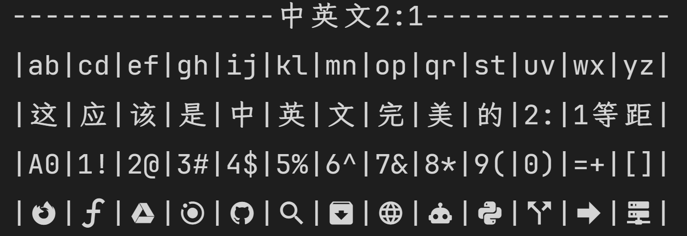

# JetBrainsLxgwNerdMono

[English](README.md) | [中文](README_zh.md)

JetBrains Mono NerdFont + LXGW WenKai Mono = 2:1 CJK Monospace Font

## Features

- English characters from JetBrains Mono NerdFont
- CJK characters from LXGW WenKai Mono GB Screen (Regular/Medium) and LXGW ZhenKai GB (Bold)
- NerdFont icons preserved and scaled to match CJK width
  - Powerline symbols (U+E0A0-U+E0DF) maintain original vertical bounds for proper terminal alignment
  - Regular icons scaled 1.4x and vertically centered
- Perfect 2:1 width ratio (CJK 1200, English 600 FUnit)
- Styles: Regular, Medium, Italic, MediumItalic, Bold, BoldItalic
- YAML configuration support with CLI override
- Multi-weight Chinese font mapping (optional)

## Quick Start

### Using uv (Recommended)

```bash
# Install dependencies
uv sync

# Build all styles
uv run python build.py

# Font Splitting (Web Fonts)
# Default input: output/fonts, output: output/split
uv run python split.py
```

### Using Docker

```bash
# Build image
docker build -t jetbrains-lxgw-nerd-mono .

# Run build
docker run --rm \
    -v $(pwd)/fonts:/app/fonts \
    -v $(pwd)/output:/app/output \
    jetbrains-lxgw-nerd-mono

# Build specific styles
docker run --rm \
    -v $(pwd)/fonts:/app/fonts \
    -v $(pwd)/output:/app/output \
    jetbrains-lxgw-nerd-mono --styles Regular,Medium
```

## Source Fonts

Place the following fonts in the `fonts/` directory:

### JetBrains Mono NerdFont (v3.4.0)

Download from [Nerd Fonts release](https://github.com/ryanoasis/nerd-fonts/releases/download/v3.4.0/JetBrainsMono.zip), extract and place these files:

- `JetBrainsMonoNLNerdFontMono-Regular.ttf`
- `JetBrainsMonoNLNerdFontMono-Medium.ttf`
- `JetBrainsMonoNLNerdFontMono-Italic.ttf`
- `JetBrainsMonoNLNerdFontMono-MediumItalic.ttf`
- `JetBrainsMonoNLNerdFontMono-Bold.ttf`
- `JetBrainsMonoNLNerdFontMono-BoldItalic.ttf`

### LXGW WenKai Mono GB Screen (v1.521)

Download directly: [LXGWWenKaiMonoGBScreen.ttf](https://github.com/lxgw/LxgwWenKai-Screen/releases/download/v1.521/LXGWWenKaiMonoGBScreen.ttf)

- `LXGWWenKaiMonoGBScreen.ttf` - Used for Regular/Italic/Medium/MediumItalic styles

### LXGW ZhenKai GB (for Bold weights)

Download directly: [LXGWZhenKaiGB-Regular.ttf](https://github.com/lxgw/LxgwZhenKai/releases)

- `LXGWZhenKaiGB-Regular.ttf` - Used for Bold/BoldItalic styles to provide heavier CJK strokes

## Output

- Generated fonts are saved to `output/fonts/`.
- Split web fonts are saved to `output/split/`.

## Font Splitting (Web Fonts)

The project includes a `split.py` script that uses [cn-font-split](https://github.com/KonghaYao/cn-font-split) to split fonts into woff2 subsets for web delivery:

```bash
# Install cn-font-split (requires Node.js)
npm install -g cn-font-split

# Run split script (processes all fonts in output/fonts)
uv run python split.py

# Custom directories
uv run python split.py --input-dir my_fonts --output-dir my_split_fonts
```

Output structure:

```
output/split/
├── all.css                  # Merged CSS importing all fonts
├── JetBrainsLxgwNerdMono-Regular/
│   ├── result.css           # Single font CSS
│   ├── index.html           # Test page (contains splitting report)
│   └── *.woff2              # Font subsets
└── ...
```

After splitting, you can open `output/split/<FontName>/index.html` to view the splitting report and preview the font.

> **Note**: Due to browser CORS policies, directly opening `index.html` may fail to load font files or JSON reports. Please use a local HTTP server:
>
> ```bash
> uv run python -m http.server 8000
> # Visit http://localhost:8000/output/split/<FontName>/index.html
> ```

## 2:1 Ratio Verification

To verify the perfect 2:1 width ratio between CJK and English characters:

```bash
# Open verification page in browser
uv run python -m http.server 8000
# Then visit http://localhost:8000/verify-2-1.html
```

The verification page supports switching between different font weights using the dropdown menu.

For split web fonts, please visit `http://localhost:8000/verify-2-1-split.html`.

Or simply open `verify-2-1.html` directly in your browser after building the fonts.



The vertical bars (`|`) should align perfectly across all lines, demonstrating that each CJK character occupies exactly twice the width of an English character.

## Command Line Options

### Build Script (build.py)

```
usage: build.py [-h] [--config CONFIG] [--styles STYLES] [--fonts-dir FONTS_DIR]
                [--output-dir OUTPUT_DIR] [--parallel PARALLEL]

options:
  --config CONFIG         Path to config.yaml (default: config.yaml)
  --styles STYLES         Comma-separated styles (default: from config)
  --fonts-dir FONTS_DIR   Source fonts directory (default: fonts/)
  --output-dir OUTPUT_DIR Output directory (default: output/fonts/)
  --parallel PARALLEL     Parallel workers (default: 1)
```

Configuration priority: CLI args > config.yaml > defaults

## Configuration

The `config.yaml` file provides centralized configuration for the build process:

```yaml
# Font metadata
font:
  family_name: "JetBrainsLxgwNerdMono"
  version: "1.3"
  author: "lvbibir"
  copyright: "Copyright (c) 2024 lvbibir"
  description: "JetBrains Mono NerdFont + LXGW WenKai Mono merged font with 2:1 CJK ratio."
  url: "https://github.com/lvbibir/JetBrainsLxgwNerdMono"
  license: "This font is licensed under the SIL Open Font License, Version 1.1."
  license_url: "https://openfontlicense.org"

# Source fonts directory
fonts_dir: "fonts"

# Styles configuration
styles:
  Regular:
    en_font: "JetBrainsMonoNLNerdFontMono-Regular.ttf"
    cn_font: "LXGWWenKaiMonoGBScreen.ttf"
    display_name: "Regular"
  # ... other styles

# Build options
build:
  styles: "Regular,Medium,Italic,MediumItalic,Bold,BoldItalic"
  output_dir: "output/fonts"
  parallel: 6

# Glyph width configuration (2:1 ratio)
width:
  en_width: 600
  cn_width: 1200
  # CJK visual scale factor (1.0 = no extra scaling, 1.08 = 8% larger)
  visual_scale: 1.08
```

### Multi-Weight Chinese Font Example

For Chinese fonts with multiple weights, specify different `cn_font` for each style:

```yaml
styles:
  Regular:
    en_font: "JetBrainsMonoNLNerdFontMono-Regular.ttf"
    cn_font: "LXGWWenKaiMonoGBScreen-Regular.ttf"
    display_name: "Regular"
  Medium:
    en_font: "JetBrainsMonoNLNerdFontMono-Medium.ttf"
    cn_font: "LXGWWenKaiMonoGBScreen-Medium.ttf"
    display_name: "Medium"
  Bold:
    en_font: "JetBrainsMonoNLNerdFontMono-Bold.ttf"
    cn_font: "LXGWWenKaiMonoGBScreen-Medium.ttf"  # Fallback to Medium
    display_name: "Bold"
```

### Split Script (split.py)

```
usage: split.py [-h] [--input-dir INPUT_DIR] [--output-dir OUTPUT_DIR]

options:
  --input-dir INPUT_DIR   Input directory containing font files (default: output/fonts)
  --output-dir OUTPUT_DIR Output directory for split fonts (default: output/split)
```

## Project Structure

```
.
├── fonts/                  # Source fonts
├── output/                 # Output directory
│   ├── fonts/              # Generated TTF fonts
│   │   └── fonts-manifest.json  # Font metadata for verification pages
│   └── split/              # Generated Web fonts (WOFF2)
├── src/
│   ├── __init__.py
│   ├── config.py           # Font configuration
│   ├── merge.py            # Core merge logic
│   └── utils.py            # Utility functions
├── build.py                # Main build script
├── split.py                # Font splitting script
├── config.yaml             # Build configuration
├── pyproject.toml          # Python project config
├── Dockerfile              # Docker build
└── README.md
```

## Acknowledgments

- [maple-font](https://github.com/subframe7536/maple-font): Implementation reference and inspiration
- [Nerd Fonts](https://github.com/ryanoasis/nerd-fonts): Developer icons
- [LXGW WenKai](https://github.com/lxgw/LxgwWenKai): Source CJK font for Regular/Medium weights
- [LXGW ZhenKai](https://github.com/lxgw/LxgwZhenKai): Source CJK font for Bold weights
- [JetBrains Mono](https://github.com/JetBrains/JetBrainsMono): Source English font
- [cn-font-split](https://github.com/KonghaYao/cn-font-split): Web font splitting tool

## License

This project is for personal use. Please check the licenses of the source fonts:

- JetBrains Mono: OFL-1.1
- LXGW WenKai: OFL-1.1
- LXGW ZhenKai: OFL-1.1
- Nerd Fonts: MIT
